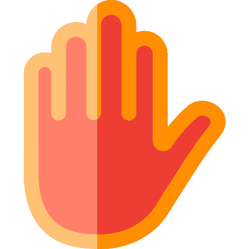
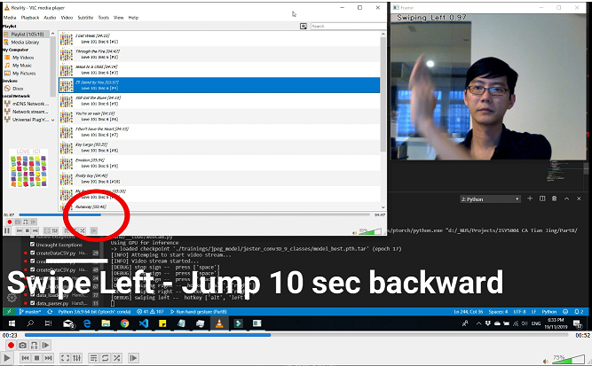

[![Contributors][contributors-shield]][contributors-url]
[![Forks][forks-shield]][forks-url]
[![Stargazers][stars-shield]][stars-url]
[![Issues][issues-shield]][issues-url]
[![MIT License][license-shield]][license-url]
[![LinkedIn][linkedin-shield]][linkedin-url]


<!-- PROJECT LOGO -->
<br />
<p align="center">
  <a href="https://github.com/eleow/Gesture-Recognition-and-Control">
    
  </a>

  <h3 align="center">Gesture-Recognition-and-Control</h3>

  <p align="center">
    Control your desktop applications with a webcam and the power of AI
    <br />
    <br />
    <br />
    ·
    <a href="https://youtu.be/28S2qK9o4ME">View Demo</a>
    ·
    <a href="https://github.com/eleow/Gesture-Recognition-and-Control/issues">Report Bug</a>
    ·
    <a href="https://github.com/eleow/Gesture-Recognition-and-Control/issues">Request Feature</a>
    ·
  </p>
</p>


## About

There are lots of repositories that offer gesture recognition via deep learning. But hardly any that provides an end-to-end solution for gesture recognition and control of an application. So here, we offer a gesture recognition and control system, that you can easily customise for your own applications.

## Demo Video

<a href="https://youtu.be/28S2qK9o4ME" target="_blank"></a>

Video available on Youtube at https://youtu.be/28S2qK9o4ME

## Getting Started

### 1. Download the Jester Dataset

In order to train the gesture recognition system, we will use TwentyBN's [Jester Dataset](https://www.twentybn.com/datasets/jester). This dataset consists of 148,092 labeled videos, depicting 25 different classes of human hand gestures. This dataset is made available under the Creative Commons Attribution 4.0 International license CC BY-NC-ND 4.0. It can be used for academic research free of charge. In order to get access to the dataset you will need to register.

The Jester dataset is provided as one large TGZ archive and has a total download size of 22.8 GB, split into 23 parts of about 1 GB each. After downloading all the parts, you can extract the videos using:

`cat 20bn-jester-v1-?? | tar zx`

More information, including alternative ways to download the dataset, is available in the [Jester Dataset](https://www.twentybn.com/datasets/jester) website.


### 2. Installation
- Clone this repo:

```sh
git clone https://github.com/eleow/Gesture-Recognition-and-Control.git
```
- Install prerequisites in requirements.txt

### 3. Modify Config File

In the root folder you will find a couple of config files. Any of these files can be used for training of the network. These files need to be modified to indicate the location of both the CSV files and the videos from the Jester dataset. The default location is `./annotations/` for the CSV files and `../20bn-jester-v1/` for the videos.

These config files also contain the parameters to be used during training and quick testing, such as the number of epochs, batch size, learning rate, etc... Feel free to modify these parameters as you see fit.

Please note that the default number of epochs used for training is set to `-1` in the `config.json` file, which corresponds to `999999` epochs. 

### 3. Create your own model
The `model.py` module already has a simple 3D CNN model that you can use to train your gesture recognition system. You are encouraged to modify `model.py` to create your own 3D CNN architecture

## Usage

### 1. Test model architecture

It is recommended that you quickly test your models before you train them on the full Jester dataset, as training takes a LOOOONNNNGG time. When quickly testing models we suggest you use the `config_quick_testing.json` file and the CPU. To do this, use the following command:
 
`python train.py --config ./config_quick_testing.json --use_gpu=False`

### 2. Create annotation files

It is likely that for your particular usecase, you might not want to have all possible classes. Due to computational limitations and/or time constraints, you might also not want to train on all 148,092 samples.

Use createDataCSV.py to create a subset based on num_samples and selected_classes.

### 3. Train model

After configuring your config.json, and setting up your annotation files, train your model using train.py.

You can choose whether you want to train the network using only a CPU or a GPU. Due to the very large size of the Jester dataset it is strongly recommended that you only perform the training using a GPU. This is controlled by the `use_gpu` flag. Also specify the GPU IDs to use by the `--gpus` flag.

`python train.py --config ./config.json --use_gpu=True --gpus 0`

### 4. Customise mapping for gestures to keyboard keystrokes

A sample configuration file mapping.ini is provided for mapping gestures to VLC shortcuts. The general syntax to specify a mapping in the INI file is `<gesture> = <type>,<key1>,<key2>,...`, where gesture can be one of the classes specified in [Jester Dataset](https://www.twentybn.com/datasets/jester), and type can be either `press`, `hotkey` or `typewrite`.

```ini
[MAPPING]
Stop Sign = press,space
Swiping Up = hotkey,ctrl,up
Swiping Down = hotkey,ctrl,down
Turning Hand Clockwise = press,p
Turning Hand Counterclockwise = press,n
Swiping Left = hotkey,alt,left
Swiping Right = hotkey,alt,right
```


### 5. Run your model and predict

Use webcam.py to start your webcam, load your trained model, perform inference, and affect your desired application by sending keystrokes based on the recognised gestures.

You can load a video file to do the same, by using the `--video` flag

```cmd
usage: webcam.py [-h] [-e EXECUTE] [-d DEBUG] [-u USE_GPU] [-g GPUS]
                 [-v VIDEO] [-vb VERBOSE] [-cp CHECKPOINT] [-m MAPPING]

optional arguments:
  -h, --help            show this help message and exit
  -e EXECUTE, --execute EXECUTE
                        Bool indicating whether to map output to
                        keyboard/mouse commands
  -d DEBUG, --debug DEBUG
                        In debug mode, show webcam input
  -u USE_GPU, --use_gpu USE_GPU
                        Bool indicating whether to use GPU. False - CPU, True
                        - GPU
  -g GPUS, --gpus GPUS  GPU ids to use
  -v VIDEO, --video VIDEO
                        Path to video file if using an offline file
  -vb VERBOSE, --verbose VERBOSE
                        Verbosity mode. 0- Silent. 1- Print info messages. 2-
                        Print info and debug messages
  -cp CHECKPOINT, --checkpoint CHECKPOINT
                        Location of model checkpoint file
  -m MAPPING, --mapping MAPPING
                        Location of mapping file for gestures to commands


```

## Troubleshooting

- If you get an error similar to `data_loader.py", line 73, in get_frame_names
frame_names += [frame_names[-1]] * (num_frames_necessary - num_frames)
IndexError: list index out of range`, ensure that the entire Jester dataset has been properly extracted and that all folders are present.


## License
Distributed under the [MIT License](LICENSE)

## Acknowledgements
Repository is modified based on code by [Udacity](https://github.com/udacity/CVND---Gesture-Recognition), which in turn, is based on TwentyBN's [GulpIO-benchmarks](https://github.com/TwentyBN/GulpIO-benchmarks) repository, written by [Raghav Goyal](https://github.com/raghavgoyal14) and the [TwentyBN](https://20bn.com/) team.

<div>Hand icon by <a href="https://www.flaticon.com/authors/freepik" title="Freepik">Freepik</a> from <a href="https://www.flaticon.com/" title="Flaticon">www.flaticon.com</a></div>

<!-- MARKDOWN LINKS & IMAGES -->
<!-- https://www.markdownguide.org/basic-syntax/#reference-style-links -->
[contributors-shield]: https://img.shields.io/github/contributors/eleow/Gesture-Recognition-and-Control
[contributors-url]: https://github.com/eleow/Gesture-Recognition-and-Control/graphs/contributors
[forks-shield]: https://img.shields.io/github/forks/eleow/Gesture-Recognition-and-Control
[forks-url]: https://github.com/eleow/Gesture-Recognition-and-Control/network/members
[stars-shield]: https://img.shields.io/github/stars/eleow/Gesture-Recognition-and-Control
[stars-url]: https://github.com/eleow/Gesture-Recognition-and-Control/stargazers
[issues-shield]: https://img.shields.io/github/issues/eleow/Gesture-Recognition-and-Control
[issues-url]: https://github.com/eleow/Gesture-Recognition-and-Control/issues
[license-shield]: https://img.shields.io/github/license/eleow/Gesture-Recognition-and-Control
[license-url]: https://github.com/eleow/Gesture-Recognition-and-Control/blob/master/LICENSE
[linkedin-shield]: https://img.shields.io/badge/-LinkedIn-black.svg?style=flat-square&logo=linkedin&colorB=555
[linkedin-url]: https://linkedin.com/in/edmundleow
[product-screenshot]: images/screenshot.png

